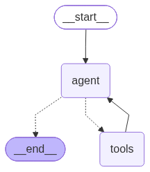

# HopeBot 3.0

An LLM-based AI care coordination agent for mental health screening and care, built as part of a UCL MSc Health Data Science dissertation project (CHME0021). HopeBot 3.0 extends a previously developed PHQ-9 screening chatbot (HopeBot 2.0) with a LangGraph agent that takes over after the mental health assessment screening, providing psycho-educational content, session preparation, appointment scheduling, and follow-up emails, with deterministic safety triage throughout.

> This is a showcase repository containing the key agent code and key evaluation results. The full deployment codebase (including the RAG knowledge base and app UI) is private; available on request.

## Architecture 


- **Screening**: PHQ-9
- **Triage**: deterministic, rule-based routing on clinical cutoffs (not LLM-scored), so severity classification can't drift or hallucinate. A positive response to the self-harm item (PHQ-9 Q9) always overrides the band-level result and routes to crisis signposting first.
- **Care coordination agent** (LangGraph; four tools):
    - Email (assessment summary + resources)
    - Psychoeducation (NICE-guideline-aligned: NG222, CG113, CG185)
    - Session preparation
    - Calendar / appointment scheduling

## Tech stack
- Python 3.10/3.11
- LangGraph, LangChain, LangSmith
- OpenAI GPT-4o (function calling for PHQ-9 scoring)
- Streamlit (UI)

## Evaluation

Two-phase user trial (Phase 1 pilot, n = 2; Phase 2 formal evaluation, n = 9 analysed after 2 exclusions).

| Metric | Threshold | Result | Pass/Fail
|---|---|---|---|
| PHQ-9 concordance (ICC) | > 0.75 | 0.98 | Pass |
| Spearman's rho | > 0.90 | 0.92 | Pass |
| Latency P50 | < 1.5s | 1.71s | Fail |
| Latency P99 | < 5s | 7.43s | Fail |
| Task completion | ≥ 90% | 92.9% | Pass |

Full statistical analysis (ICC, Bland-Altman, Wilcoxon signed-rank, Spearman's rho, Cronbach's alpha, reflexive thematic analysis) in [`analysis/analysis.ipynb`](analysis/analysis.ipynb). 

Performance monitoring (latency, token usage, task completion) via LangSmith, extracted with [`analysis/extract_metrics.py`](analysis/extract_metrics.py).

## Repository contents
```text
├── app.py                        # Streamlit application
├── my_agent/
│   ├── agent.py                  # Triage, routing, LangGraph agent
│   └── tools.py                  # Email, psychoeducation, session prep, calendar tools
├── analysis/
│   ├── analysis.ipynb            # Statistical analysis (run on synthetic data)
│   └── extract_metrics.py        # LangSmith performance metrics extraction
├── data/synthetic/                # Synthetic PHQ-9 data for demonstration
└── docs/                          # Architecture diagram
```

## Data and ethics
This study was approved under UCL Ethics Project ID 1765. No real participant data is included in this repository. `analysis/analysis.ipynb` runs on synthetically generated PHQ-9 data (`np.random.seed(100)`), and any output shown reflects that synthetic data, not participant responses. Real participant data was kept local only and never version-controlled, per the study's data management plan.

## Setup (agent code only)
This repo does not include the RAG knowledge base or `.env`/API keys required to run the full app. 
To explore the agent logic: 
```bash 
pip install -r requirements.txt 
cp .env.example .env # add your own OpenAI API key 
``` 

See `my_agent/agent.py` and `my_agent/tools.py` for the core logic. 

## Author 
Rachel Lau Kai Ling — MSc Health Data Science, UCL Institute of Health Informatics 
Supervised by Dr Kezhi (Ken) Li
